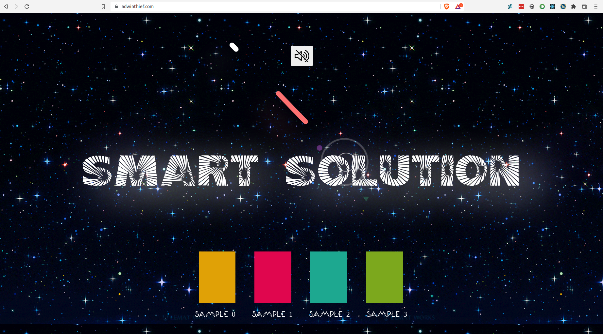

## SPACE JAM DJ BOARD FOR LIVESTREAMING MUSIC

https://adwinthief.com

I made a publicly available website to which it is possible to submit data that changes the audio volume of specific audio samples and also visualizes these changes with bars. The server has only a single state, which is constantly pushed out to all the clients connected to the website (they are automatically subscribed to that stream).

There is also an endpoint for playing laser sounds and displaying them in the background, this is triggered with a button press.

There is no access control, so if anyone submits data to the /publish endpoint I created, it will be accordingly sent out to all the clients connected. DJs can battle it out to decide whose music will dominate.

---
